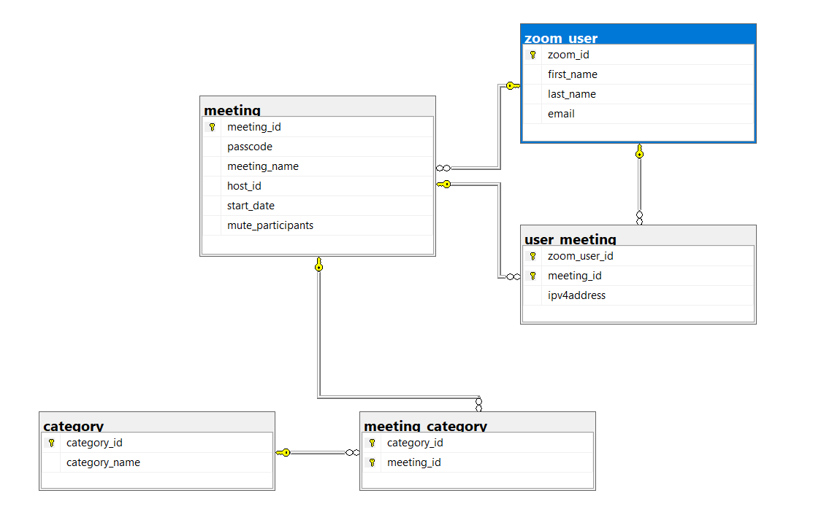

# SQL Challenge

Each solution must be a single sql query statement. The data used to test your queries may be different than the data you are given. The schema will be the same. All table names should be lower cased.

## Schema



## Query 1

Return the zoom_id, last_name and first_name, of all users with a last name of Stradling.   The results should be in zoom_id order ascending.

Answer:

```sql
SELECT zoom_id, last_name, first_name FROM zoom_user
  WHERE last_name = 'Stradling'
  ORDER BY zoom_id ASC;
```

## Query 2

Return all meeting_id, meeting_name, and start date for all meetings that have the word mobile in the meeting name.  It should be returned by meeting_id ascending.

Answer:

```sql
SELECT meeting_id, meeting_name, start_date FROM meeting
  WHERE meeting_name LIKE '%mobile%'
  ORDER BY meeting_id ASC;
```

## Query 3

Return the meeting_name, and last_name of the host for the meeting that has a passcode of 939904.

Answer:

```sql
SELECT meeting_name, last_name FROM meeting
  JOIN zoom_user ON meeting.host_id = zoom_user.zoom_id
  WHERE passcode = 939904;
```

## Query 4

Return meeting_id, meeting_name, and count of how many users are attending the meeting.  It should be ordered by the # of people attending the meeting then by meeting id.

## Query 5

Return back the query above, but only for meetings that have 13 or more attendees.

## Query 6

Return zoom_id, email address ordered by zoom_id of all users who have not hosted a meeting or attended a meeting.

## Query 7

Return the meeting_id, meeting_name, passcode ordered by meeting_id of all meetings that are categorized as both Research and Education.

## Query 8

Return the last name, email, meeting_name and ipv4address ordered by email of all people who have attended a meeting that was catagorized as a Conference and the ipv4address starts with 159.

## Query 9

Return the meeting_name, meeting_id and passcode for all meetings that have a null for the passcode.  Order the results by meeting_name descending. 

## Query 10

Return the last_name, email, role for all users that either attended or hosted the meeting named ‘Ameliorated responsive encoding’ .  Order the results by Role desc then email ascending.

## Query 11

Return the first_name, last_name, and meeting for all users has an email address for endgadget.com.  The meeting should be any meeting they’ve hosted, if they’ve never hosted a meeting it should be null.

